Clients : Tg bot + web
Games:
* poker need to do FSM
* horse race
* slots

Year  confirmation at User service
CrypotGraphic random(System.Security.Cryptography)
No real money just virtual credits

### Modules
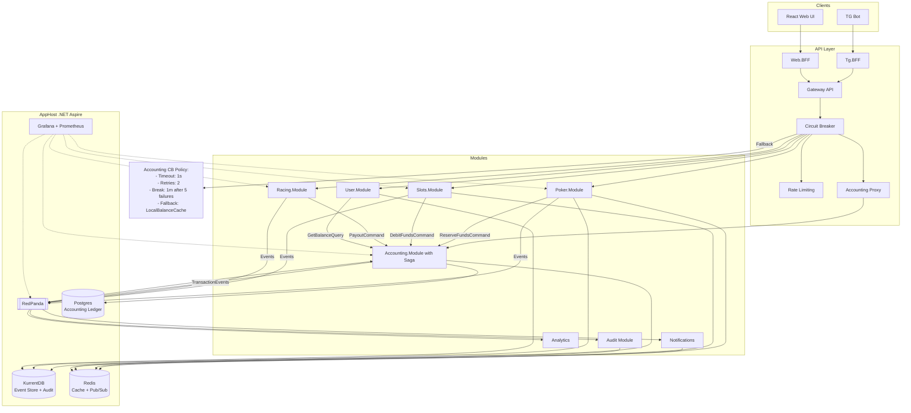

## Poker
Tables - SignalR
Need to improve
Event Sourcing + snapshoting for history of players actions
Need to handle network drops
RNG for slots service


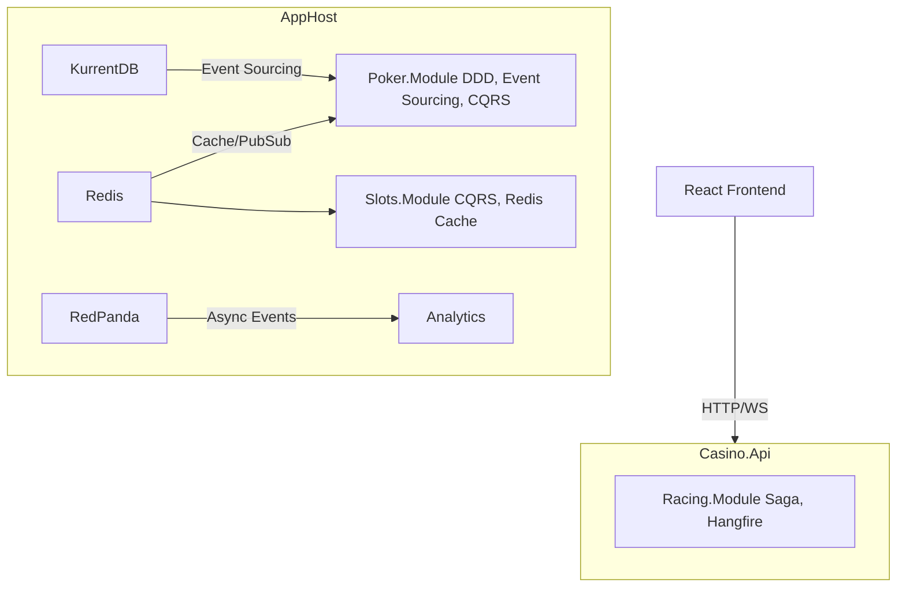

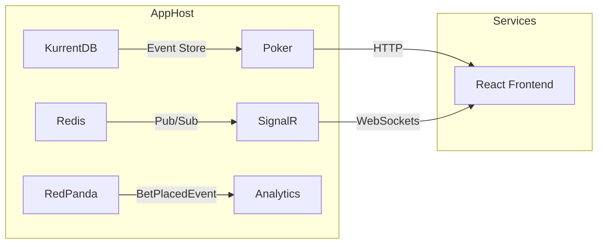

Pocker
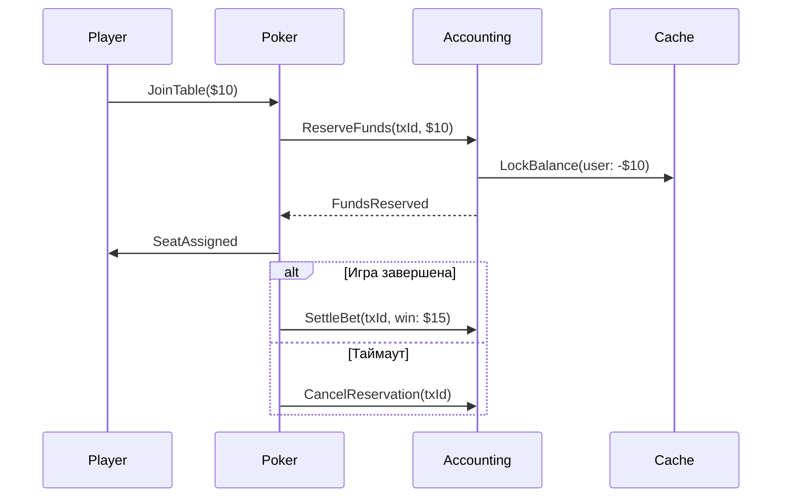

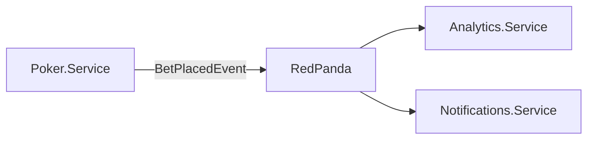

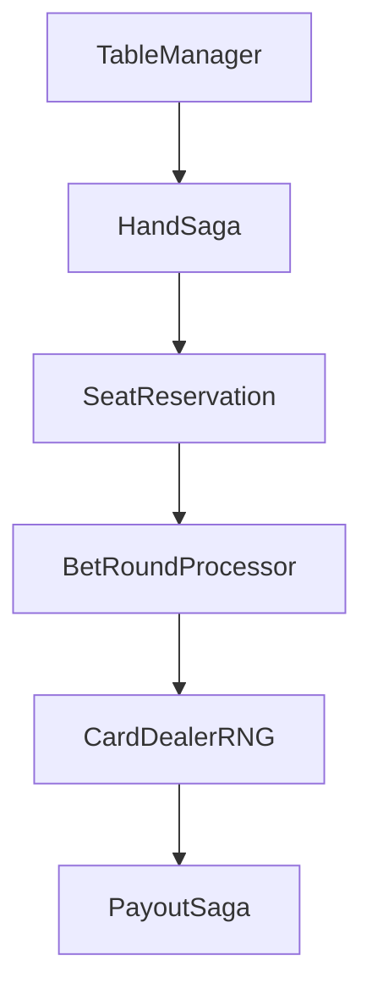


Racing

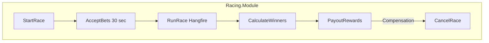

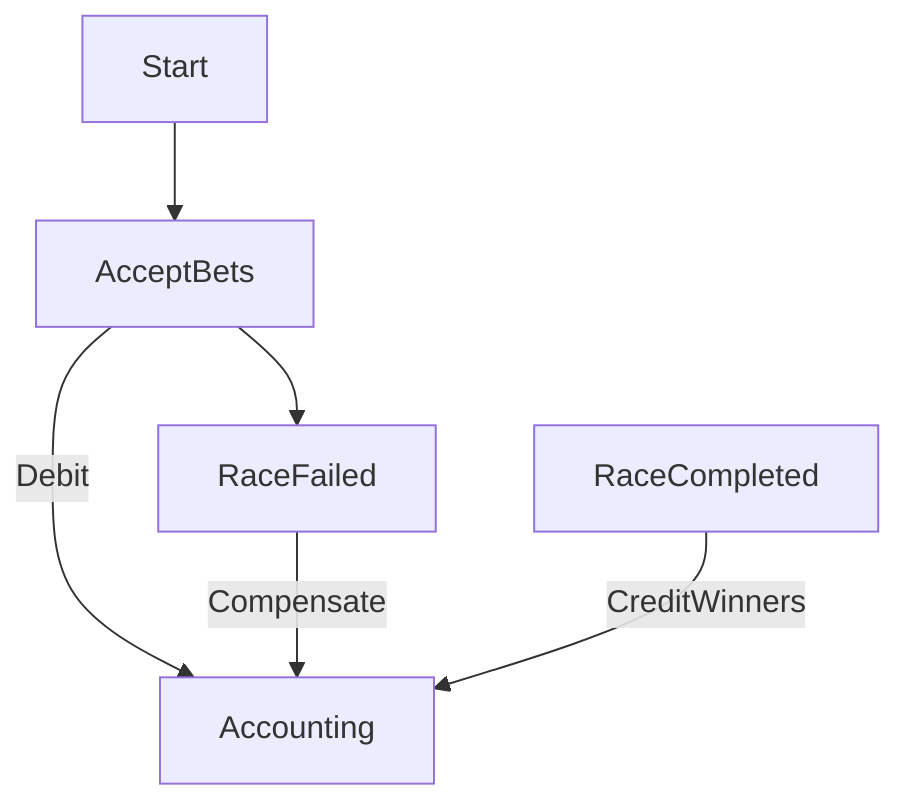
## Data Flow
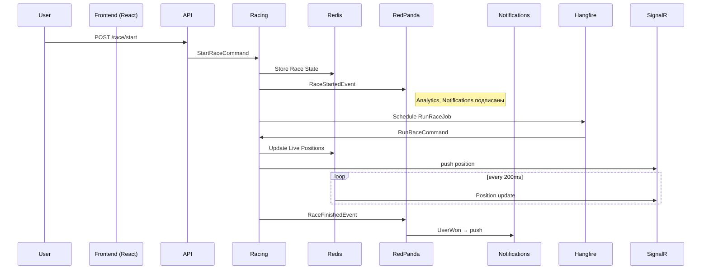

### Circuit breaker


Limits
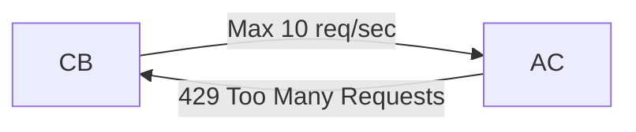

### Accounting module
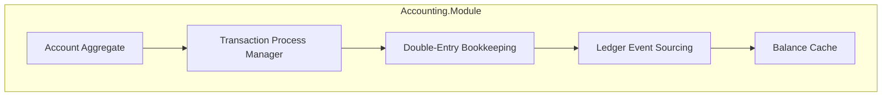

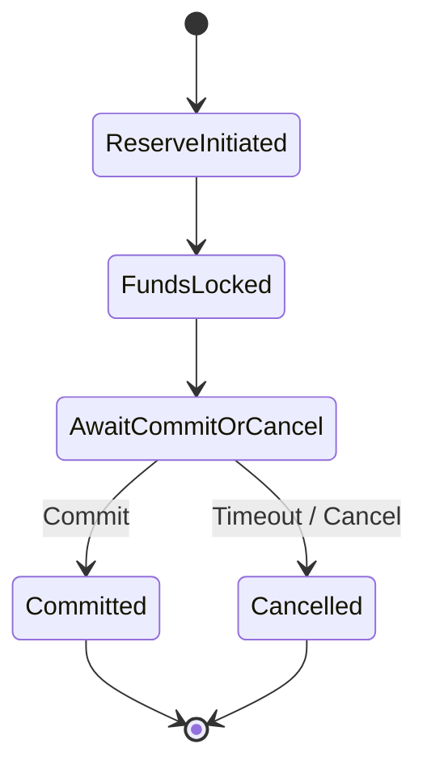
 +kafka topics 
```
accounting.transaction-events
accounting.saga-events
```
Every Event has:
- `transactionId`
- `userId`
- `amount`
- `status`
- `timestamp`
- `originModule` (Poker, Slots…)

Poker 
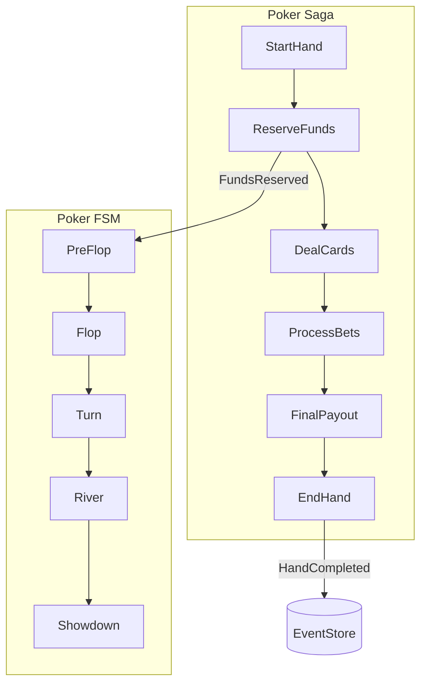
FSM <-> Saga at pocker
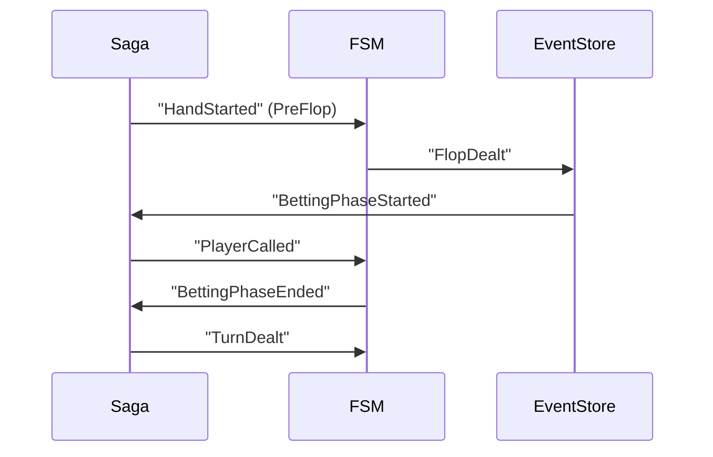

Saga for bet FSM for rules
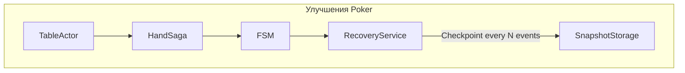


### Racing module
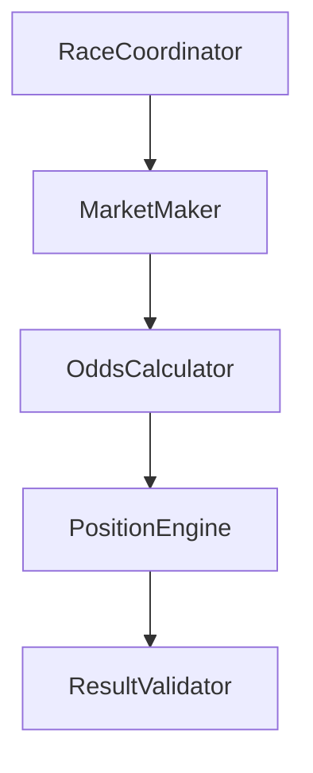
