Clients : Tg bot + web
Games:
* poker need to do FSM
* horse race
* slots
* black jack

Year  confirmation at User service
CrypotGraphic random(System.Security.Cryptography)
No real money just 
### Modules
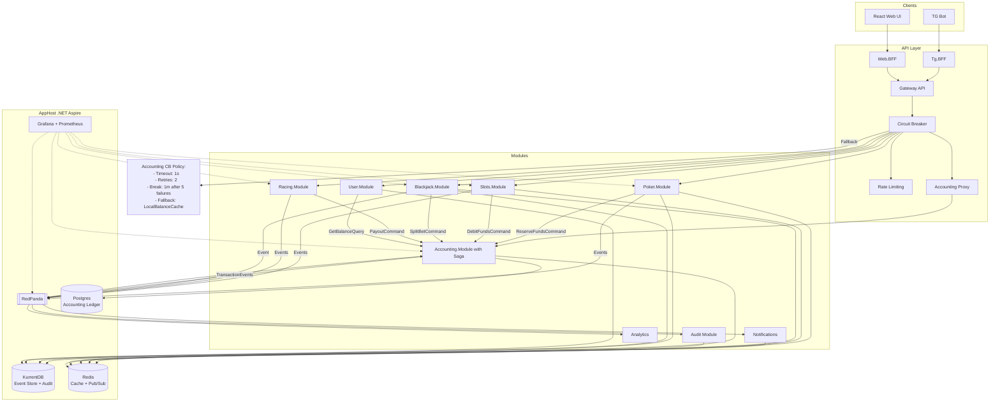

## Poker
Tables - SignalR
Need to improve
Event Sourcing + snapshoting for history of players actions
Need to handle network drops
RNG for slots service
	 **dead man's switch**


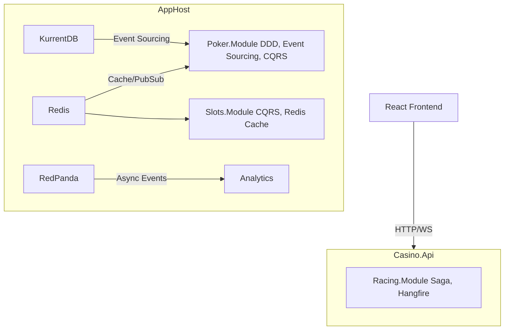

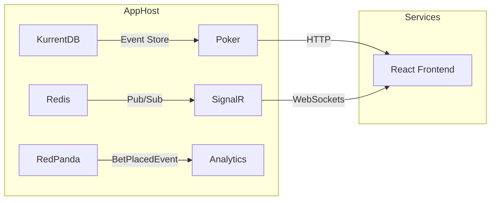

Pocker
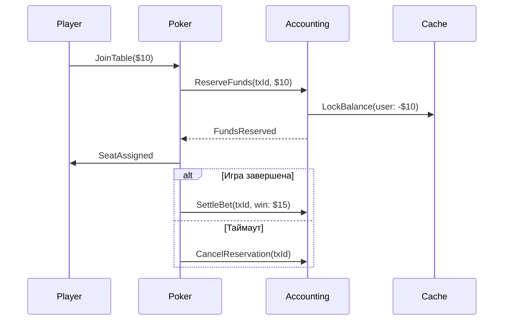

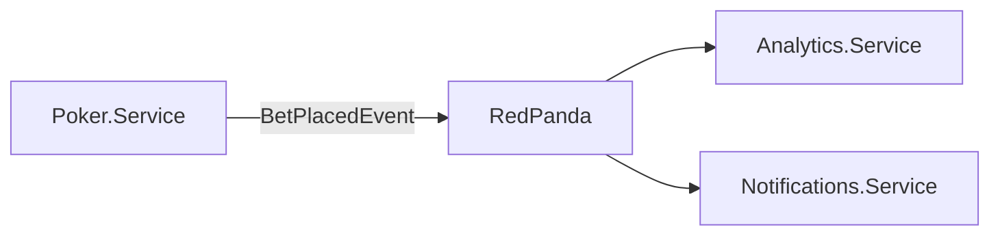

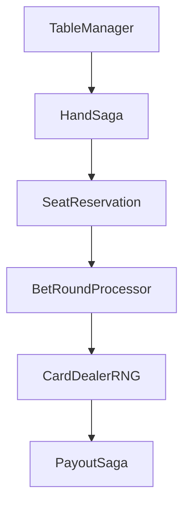


Racing

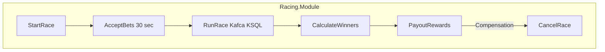

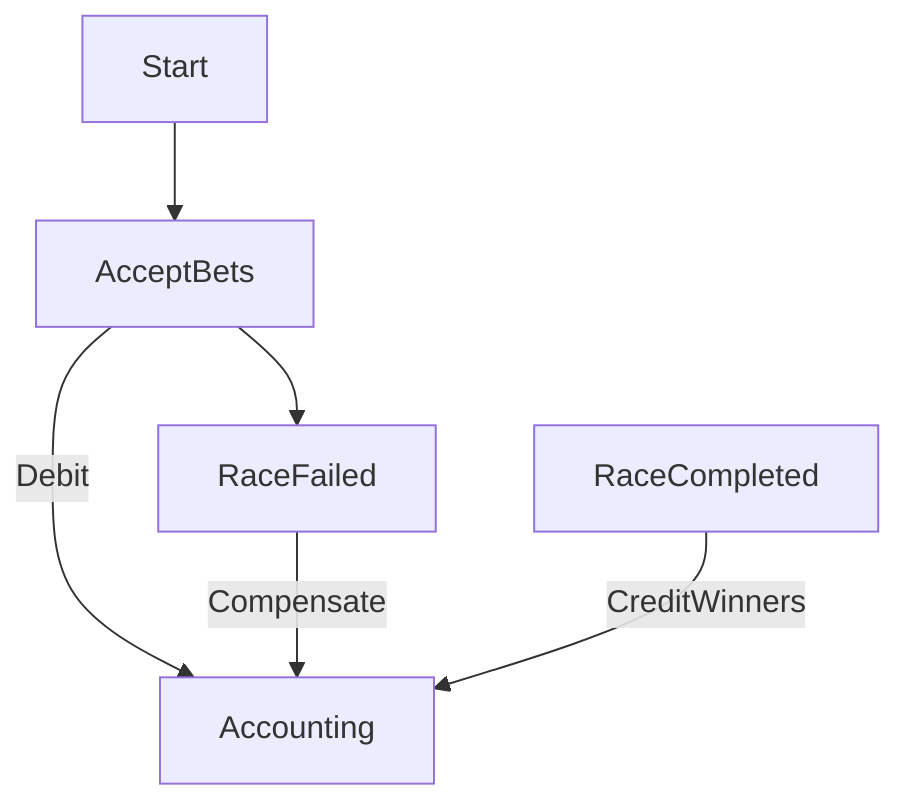

Blackcjack
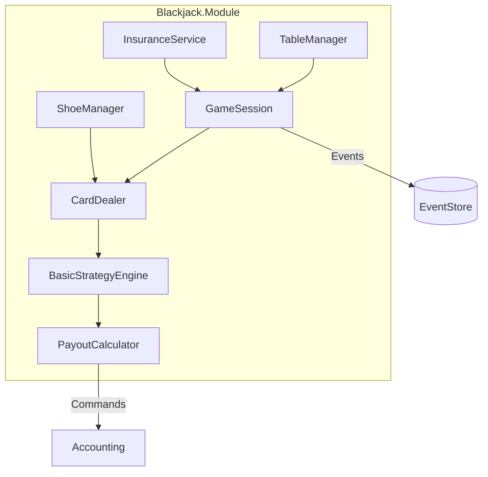


## Data Flow BlackJack
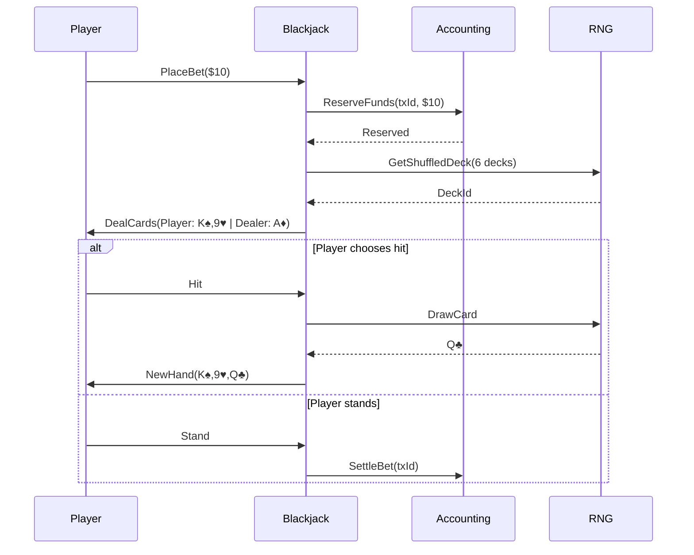

## Data Flow Racing
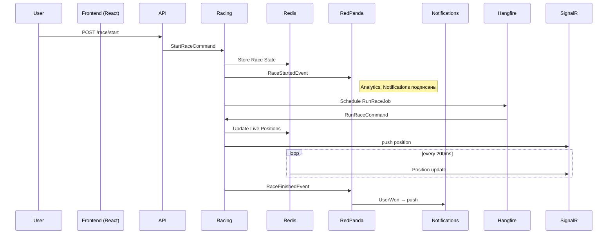

### Circuit breaker
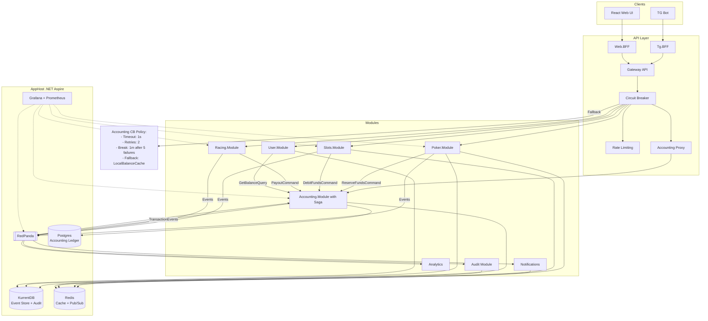

Limits
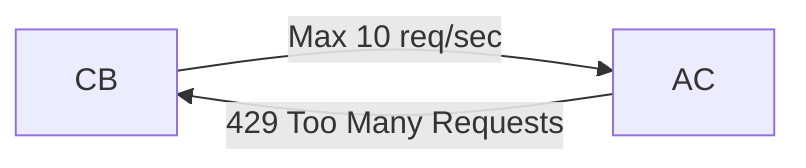

### Accounting module
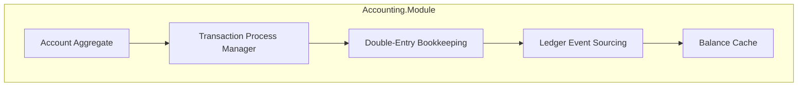

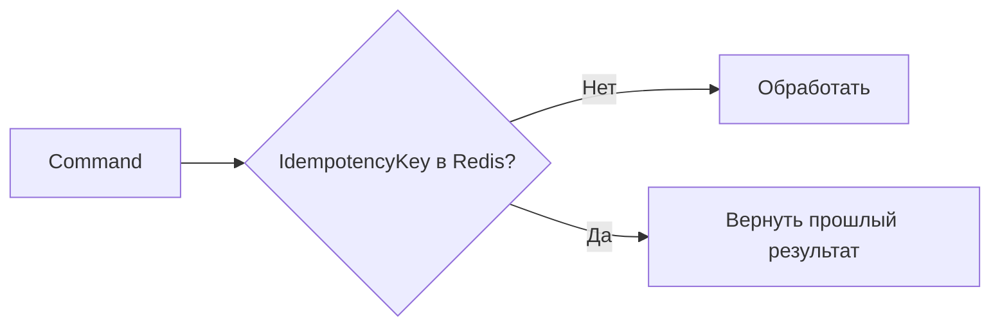

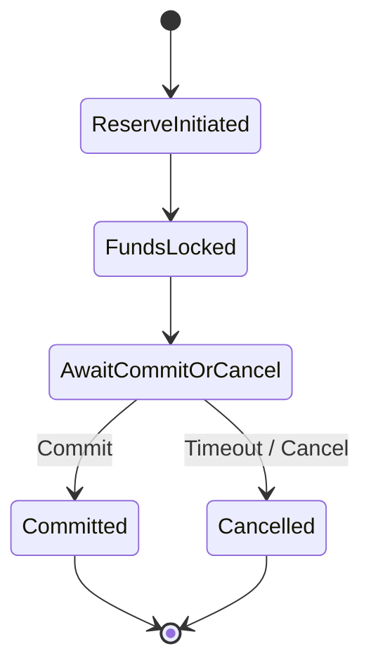
 +kafka topics 
```
accounting.transaction-events
accounting.saga-events
```
Every Event has:
- `transactionId`
- `userId`
- `amount`
- `status`
- `timestamp`
- `originModule` (Poker, Slots…)

Poker 
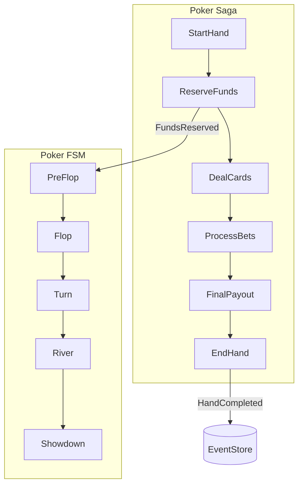

Pocker FSM
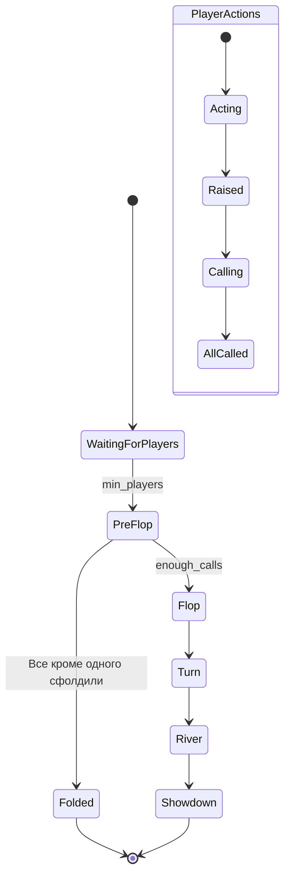

Pocker auto fold timeout
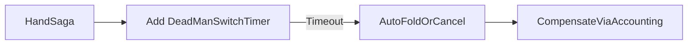

Pocker waiting diagram
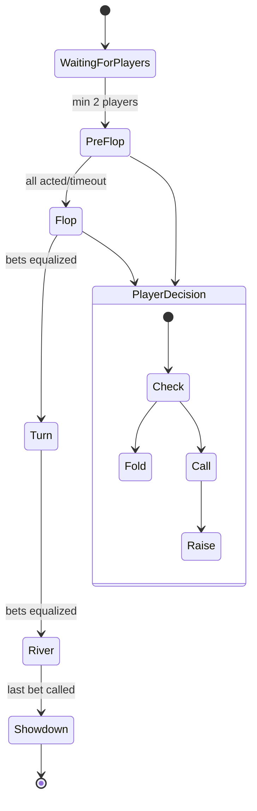

FSM <-> Saga at pocker
```mermaid
sequenceDiagram
    participant Saga
    participant FSM
    participant EventStore

    Saga->>FSM: "HandStarted" (PreFlop)
    FSM->>EventStore: "FlopDealt"
    EventStore->>Saga: "BettingPhaseStarted"
    Saga->>FSM: "PlayerCalled"
    FSM->>Saga: "BettingPhaseEnded"
    Saga->>FSM: "TurnDealt"
```

Saga for bet FSM for rules
```mermaid
flowchart TD
    subgraph Poker
        A[TableActor] --> B[HandSaga]
        B --> C[FSM]
        C --> D[RecoveryService]
        D -->|"Checkpoint every N events"| E[SnapshotStorage]
    end
```


### BlackJack FSM
```mermaid
stateDiagram-v2
    [*] --> Betting
    Betting --> Dealing: All bets done
    Dealing --> PlayerTurn: The cards have been dealt
    PlayerTurn --> DealerTurn: All end
    DealerTurn --> Payout: Diller end
    Payout --> [*]
    
    state PlayerTurn {
        [*] --> HitOrStand
        HitOrStand --> DoubleDown: If allowed
        DoubleDown --> Stand
    }
```

### BlackJack Event Sourcing
```mermaid
flowchart TD
    A[GameStarted] --> B[BetPlaced]
    B --> C[CardsDealt]
    C --> D[PlayerHit]
    D --> E[PlayerStand]
    E --> F[DealerRevealed]
    F --> G[PayoutCompleted]
    
    style A fill:#f9f,stroke:#333
    style G fill:#bbf,stroke:#333
```

### BlackJack Integration Points
```mermaid
flowchart LR
    BJ[Blackjack] -->| ReserveFunds| AC[Accounting]
    BJ -->| GetTrueRandom| RNG[RNG Service]
    BJ -->| PublishOutcome| ES[EventStore]
    BJ -->| NotifyResult| WS[WebSockets]
    WS -->|Push| Player[Player UI]
```

### Racing module
```mermaid
flowchart TD
    A[RaceCoordinator] --> B[MarketMaker]
    B --> C[OddsCalculator]
    C --> D[PositionEngine]
    D --> E[ResultValidator]
```

RNG verifications
```mermaid
flowchart TD
    A[PositionEngine] --> B[Add DeterministicRNG]
    B --> C[Seed=RaceId+Round]
    C --> D[Повторяемость результатов]
```

## Tournament Module
```mermaid
flowchart TD
    subgraph Tournament.Module
        TM[TournamentManager]
        TM -->|Manages| TS[TournamentState]
        TM -->|Coordinates| TR[TournamentRegistry]
        TM -->|Routing| TSched[TableScheduler]
        TM -->|Rules| TRules[TournamentRulesEngine]
        
        subgraph Games
            TSched -->|Create tables| Poker[Poker.Module]
            TSched -->|Create tables| Blackjack[Blackjack.Module]
        end

        TM -->|Payment logic| Accounting[Accounting.Module]
        TM -->|Notifications| Notify[Notifications]
    end

    TM -->|Events| Bus[[RedPanda]]
    Bus --> Analytics[Analytics]
    Bus --> Audit[Audit]
```

### Tournament states
```mermaid
stateDiagram-v2
    [*] --> Registration
    Registration --> Scheduled: Enough players
    Scheduled --> Running: Timer start
    Running --> Rebalancing: The player is eliminated
    Rebalancing --> Running
    Running --> FinalStage: There are less ≤  than M players
    FinalStage --> Completed: The winner has been
    Completed --> Payouts: Payouts
    Payouts --> [*]

    note left of Registration
        Rules:
        - Minimum number of players: N
        - Maximum: 10*N
        - Login via Accounting.ReserveFunds
    end note
```

### Tournament starts
```mermaid
sequenceDiagram
    participant User
    participant API
    participant Tournament
    participant Poker/Blackjack
    participant Accounting

    User->>API: Register for the tournament ($20)
    API->>Accounting: ReserveFunds(userId, $20)
    Accounting-->>API: OK
    API->>Tournament: AddPlayer(tournamentId, userId)
    Tournament->>Tournament: Check the minimum number 
    alt Enough players
        Tournament->>Poker/Blackjack: CreateTables(players, rules)
        Poker/Blackjack-->>Tournament: TablesReady
        Tournament->>Bus: TournamentStartedEvent
    else NotEnough
        Tournament->>API: WaitingForPlayers
    end
```

### Ребалансировка столов
```mermaid
flowchart LR
    subgraph Tournament
        A[Player eliminated] --> B{Check the number of players}
        B -->|Table < M/2| C[Combine tables]
        B -->|Table > M+1| D[Divide the table]
        C & D --> E[Update the Tournament Registry]
        E --> F[Notify players via WebSocket]
    end
```
```mermaid
sequenceDiagram
    TournamentManager->>TableManager: BalanceTablesRequest
    TableManager->>PokerEngine: GetCurrentStacks
    PokerEngine-->>TableManager: StackInfo
    TableManager->>TournamentManager: ProposedRebalance
```
###  Pocker Tournament
```mermaid
flowchart TD
    subgraph Poker.Module
        PT[PokerTable] -->|Events| TM[PokerTournamentManager]
        TM -->|Commands| PT
    end

    NoteP[PlayerEliminated/TableNeedsRebalance]
    PT --> NoteP

```

### Blackjack tournament
```mermaid
flowchart TD
    subgraph Blackjack.Module
        BT[BlackjackTable] -->|Events| TM[BlackjackTournamentManager]
        TM -->|Commands| BT
    end

    NoteB[PlayerBusted\TournamentRoundEnded]
    BT --> NoteB

```

| Parameter | Poker Tournament | Blackjack Tournament |
| ------------------ | -------------------- | ----------------------------------- |
| **Victory**         | Last survivor | Highest bankroll after N rounds |
| **Rebalancing** | Pool tables | Fixed tables |
| **Timings**       | Growing Blinds | Fixed rounds (3 min)        |
| **Payments**        | Prizes (1-3) | Top 10% of players |

### Kafka topics for tournaments
```
tournament.events
  - TournamentStarted
  - PlayerEliminated
  - PrizePoolUpdated

tournament.commands
  - AddPlayer
  - StartTournament
  - CancelTournament
```

### Cancelations
```mermaid
sequenceDiagram
    Tournament->>Accounting: CancelReservation(tournamentId)
    Accounting->>Tournament: FundsReleased
    Tournament->>Poker/Blackjack: DestroyAllTables()
```
